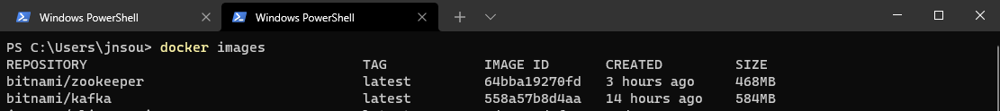
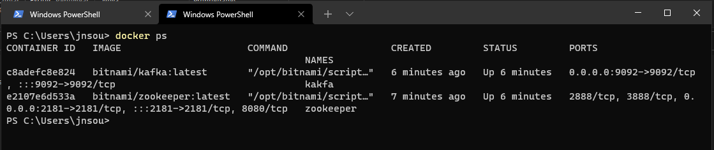
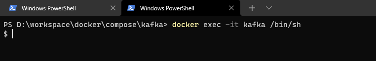
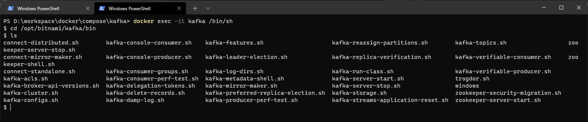
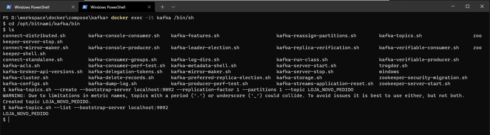

# Executar Kafka via Docxker

## Docker-compose
```yml
version: "3"
services:
  zookeeper:
    image: 'bitnami/zookeeper:latest'
    container_name: zookeeper
    ports:
      - '2181:2181'
    environment:
      - ALLOW_ANONYMOUS_LOGIN=yes
  kafka:
    image: 'bitnami/kafka:latest'
    container_name: kakfa
    ports:
      - '9092:9092'
    environment:
      - KAFKA_BROKER_ID=1
      - KAFKA_LISTENERS=PLAINTEXT://:9092
      - KAFKA_ADVERTISED_LISTENERS=PLAINTEXT://127.0.0.1:9092
      - KAFKA_ZOOKEEPER_CONNECT=zookeeper:2181
      - ALLOW_PLAINTEXT_LISTENER=yes
    depends_on:
      - zookeeper 
```

## Execução

```bash
docker-compose -f docker-compose.yml up
```

```bash
docker images
```


```bash
docker ps
```


## Acessar o bash do container

```bash
docker exec -it kafka /bin/sh
```


## Acessar diretorio kafka dentro container
```bash
$ cd /opt/bitnami/kafka/bin
```


## Agora podemos executar qualquer comando kafka como criar topico ou listar
```bash
$ kafka-topics.sh --create --bootstrap-server localhost:9092 --replication-factor 1 --partitions 1 --topic LOJA_NOVO_PEDIDO
```

```bash
kafka-topics.sh --list --bootstrap-server localhost:9092
```




## Produtor de mensagem
 - Enviar mensagem para o topico

```bash
kafka-console-producer.sh --broker-list localhost:9092 --topic LOJA_NOVO_PEDIDO

>pedido0, 550
>pedido1, 330
>pedido2, 67213
```

## Consumer menssagens

```
kafka-console-consumer.sh --bootstrap-server localhost:9092 --topic LOJA_NOVO_PEDIDO
```
Nesse caso não mostrou mensagem devido pegar o momento 

### Mostrar as mensagem desde o começo

```
kafka-console-consumer.sh --bootstrap-server localhost:9092 --topic LOJA_NOVO_PEDIDO --from-beginning
pedido0, 550
pedido1, 330
pedido2, 67213
```

# Referências

[github/shabbirdwd53](https://gist.github.com/shabbirdwd53/d3b531d61379068da26d16487e37af34)

[How to install Kafka using Docker & Docker Compose in any Operating System | Windows | MacOS | Linux](https://www.youtube.com/watch?v=2pBxoal7DY4)
